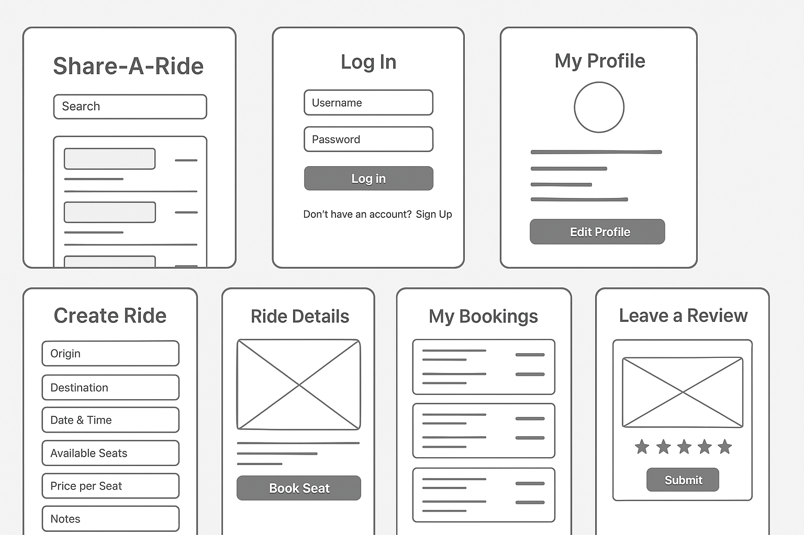
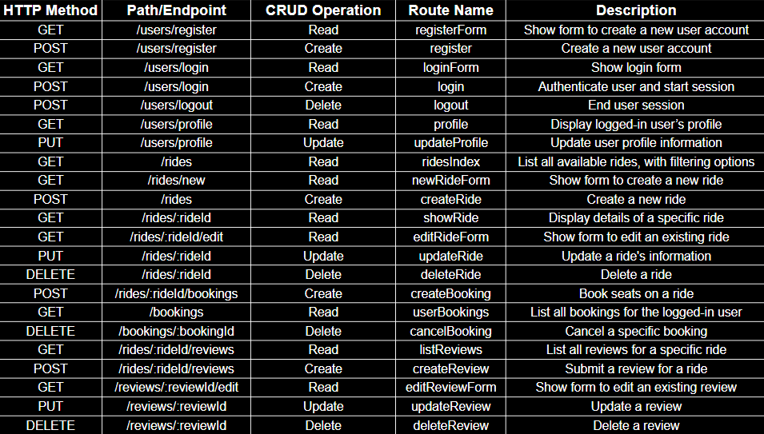

# Share-A-Ride  
Community Carpooling Made Easy

 (Chatgpt, 2025)

## Overview  
Share-A-Ride is a practical web application designed to help local community members share rides efficiently and securely. Drivers can create ride offers by providing key details like origin, destination, date, time, and available seats. Passengers can browse, search, and book seats on rides that fit their schedules. The platform promotes eco-friendly transportation and cost savings by facilitating simple, reliable ride sharing without complexity.

The app focuses on ease of use with clear workflows and secure session-based authentication. Users manage their rides, bookings, and reviews through an intuitive interface that encourages participation and trust.

## User Stories  
- As a user, I want to create an account by signing up with a username, email, and password so that I can securely access the app.  
- As a user, I want to log in and maintain a session so that my data and actions remain secure during my app use.  
- As a user, I want to update my profile information like name and contact details to personalize my account.  
- As a guest user, I want to browse available rides without logging in to explore options before registering.  
- As a user, I want to search rides by origin, destination, and date to find rides matching my travel needs.  
- As a user, I want to create a ride with origin, destination, date/time, and available seats so I can offer transportation.  
- As a user, I want to edit or cancel rides I have created in case of changes or cancellations.  
- As a user, I want to see a list of my created rides and their booking status to stay organized.  
- As a user, I want to book seats on rides offered by others after logging in to secure a spot.  
- As a user, I want to cancel bookings if my plans change, allowing flexibility.  
- As a user, I want to view a list of my booked rides to manage my upcoming trips.  
- As a user, I want to leave simple text reviews for rides I have completed to share feedback with the community.  
- As a user, I want to see ratings and reviews on rides and drivers to make informed decisions.  
- As a user, I want clear error messages if I try actions I’m not authorized to perform, like booking while logged out.  
- As a user, I want to log out securely to protect my account on shared devices.  

## Entity Relationship Diagram (ERD)

User
| Field     | Type   | Options             |
|-----------|--------|---------------------|
| _id       | ObjectId | Primary Key (auto-generated by MongoDB) |
| username  | String | { required: true } |
| password  | String | { required: true } |

---

Ride
| Field             | Type       | Options                          |
|-------------------|-----------|-----------------------------------|
| rideId            | ObjectId  | Primary Key                       |
| driverId          | ObjectId  | { ref: "User", required: true }   |
| origin            | String    | { required: true }                |
| destination       | String    | { required: true }                |
| departureDateTime | DateTime  | { required: true }                |
| seatsAvailable    | Number    | { required: true }                |
| pricePerSeat      | Number    |                                   |
| notes             | String    |                                   |
| createdAt         | DateTime  | { default: now }                  |
| updatedAt         | DateTime  |                                   |

---

Booking
| Field       | Type       | Options                                   |
|-------------|-----------|--------------------------------------------|
| bookingId   | ObjectId  | Primary Key                                |
| rideId      | ObjectId  | { ref: "Ride", required: true }            |
| passengerId | ObjectId  | { ref: "User", required: true }            |
| seatsBooked | Number    | { required: true, min: 1 }                 |
| bookingDate | DateTime  | { default: now }                           |
| status      | String    | { enum: ["active", "canceled"], default: "active" } |
| createdAt   | DateTime  | { default: now }                           |
| updatedAt   | DateTime  |                                            |

---

Review
| Field     | Type       | Options                                   |
|-----------|-----------|--------------------------------------------|
| reviewId  | ObjectId  | Primary Key                                |
| rideId    | ObjectId  | { ref: "Ride", required: true }            |
| authorId  | ObjectId  | { ref: "User", required: true }            |
| rating    | Number    | { required: true, min: 1, max: 5 }         |
| comment   | String    |                                            |
| createdAt | DateTime  | { default: now }                           |
| updatedAt | DateTime  |                                            |

---

Relationships Table

| Relationship Type | From Entity | To Entity | Description |
|-------------------|-------------|-----------|-------------|
| One-to-Many       | User        | Ride      | A **User** (driver) can create many **Rides**, but each Ride has exactly one driver. |
| One-to-Many       | User        | Booking   | A **User** (passenger) can make many **Bookings**, but each Booking belongs to one passenger. |
| One-to-Many       | User        | Review    | A **User** can write many **Reviews**, but each Review has exactly one author. |
| One-to-Many       | Ride        | Booking   | A **Ride** can have many **Bookings**, but each Booking belongs to one Ride. |
| One-to-Many       | Ride        | Review    | A **Ride** can have many **Reviews**, but each Review is tied to one Ride. |

## Pseudocode  
``` text
// On page load:
// - Show landing page with options to log in or browse rides.

// On signup:
// - Validate user inputs.
// - Create new user and start session.
// - Redirect to user dashboard.

// On login:
// - Validate credentials.
// - Start session on success.
// - Redirect to user dashboard.

// On ride creation:
// - Show form for origin, destination, date/time, seats.
// - Validate inputs.
// - Save ride linked to driver.
// - Redirect to rides list or dashboard.

// On browsing rides:
// - Display rides with filter options (origin, destination, date).
// - Allow pagination or search.

// On booking seats:
// - Check if user is logged in.
// - Validate seat availability.
// - Create booking linked to ride and passenger.

// On cancelling bookings:
// - Allow user to cancel before ride date.
// - Update seat availability.

// On editing or cancelling rides:
// - Verify user owns the ride.
// - Allow updates or cancellation.

// On reviews:
// - Allow users to submit text feedback after ride completion.
// - Calculate average rating.
// - Display ratings with rides.

// On logout:
// - Destroy session.
// - Redirect to landing or login page.
```
## Wireframe
 

## RESTful Routing Table
 